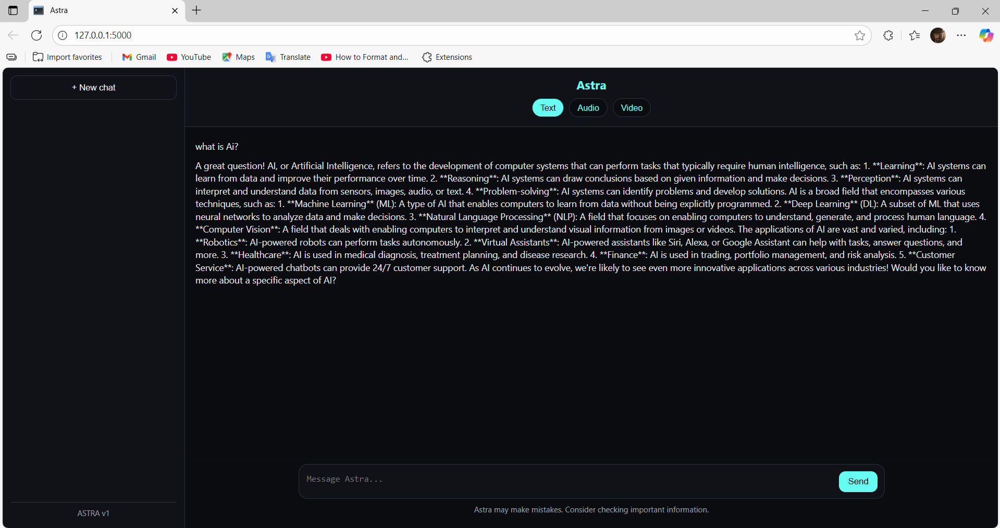
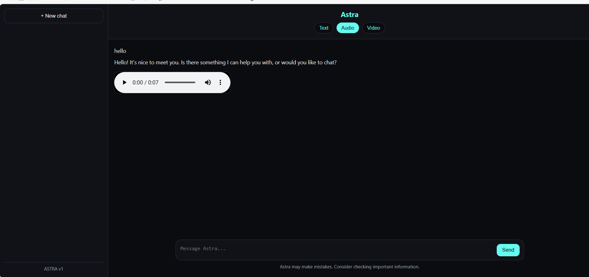
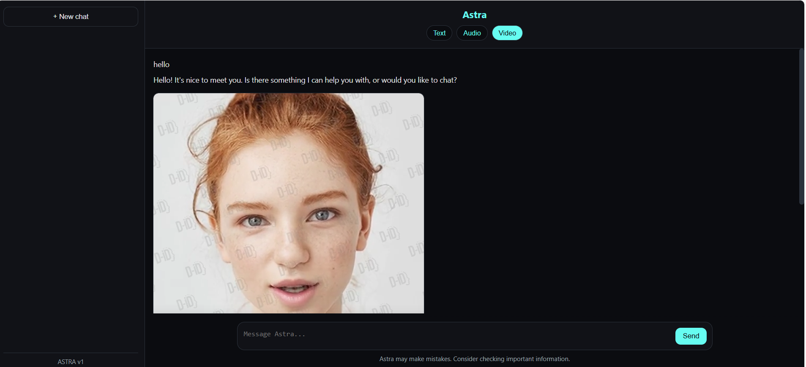

# 🌙 Astra AI Project

[](https://www.python.org/)
[](https://flask.palletsprojects.com/)
[](LICENSE)
[](https://github.com/dhinoop/astra-ai-project/stargazers)
[](https://github.com/dhinoop/astra-ai-project/network/members)

Astra AI is an intelligent assistant built with **Flask** and **Generative AI** integration.  
It provides interactive responses via text, audio, and video modes, making it versatile for real-time AI experiences.  

---

## 🚀 Features
- 📝 **Text Mode** – Get instant AI-powered answers.  
- 🔊 **Audio Mode** – Listen to responses with natural TTS (Text-to-Speech).  
- 🎥 **Video Mode** – Lip-synced avatar responses using AI-powered video generation.  
- 🌐 **Web Interface** – Simple Flask app with HTML templates and static assets.  

---

## 🛠️ Tech Stack
- **Backend:** Flask (Python)  
- **Frontend:** HTML, CSS, JavaScript (templates + static files)  
- **AI/ML:** Generative AI APIs / models (LLM, gTTS, D-ID)  
- **Other Tools:** Git, Virtualenv, Python dependencies  

---

## 📂 Project Structure
```
Astra-AI-Project/
│── app.py              # Main Flask application
│── requirements.txt    # Python dependencies
│── README.md           # Project documentation
│── .gitignore          # Ignored files (venv, cache, etc.)
│── static/             # CSS, JS, images, audio, video
│   └── screenshots/    # Screenshots for README
│   └── video/          # Demo video
│── templates/          # HTML templates
```

---

## ⚙️ Installation & Setup

1. **Clone the repository**
   ```bash
   git clone https://github.com/dhinoop/astra-ai-project.git
   cd astra-ai-project
   ```

2. **Create & activate a virtual environment**
   ```bash
   python -m venv venv
   source venv/bin/activate   # On Mac/Linux
   venv\Scripts\activate      # On Windows
   ```

3. **Install dependencies**
   ```bash
   pip install -r requirements.txt
   ```

4. **Run the Flask app**
   ```bash
   python app.py
   ```
   Visit: `http://127.0.0.1:5000/`

---

## 🎥 Video Mode (with D-ID API)

Astra AI integrates the **[D-ID API](https://www.d-id.com/)** to generate **lip-synced avatar videos**.  
- Uses **D-ID’s default avatar** for video responses.  
- AI responses are first converted into speech using **gTTS (Google Text-to-Speech)**.  
- The generated audio is sent to the **D-ID API**, which returns a talking video.  
- The video is then displayed in the Flask web interface under the **Video Mode** option.  

⚠️ **Note:** This requires a valid **D-ID API key**. Add your key in the project configuration before running the app.  

---

## 📸 Demo

### 📝 Text Mode  
  

### 🔊 Audio Mode  
  

### 🎥 Video Mode (with D-ID Avatar)  
  

▶️ **Full Demo Video:**  
[](static/video/demo.mp4)  

*(Replace these placeholders with your actual screenshots and demo video)*

---

## 🤝 Contributing
Pull requests are welcome. For major changes, please open an issue first to discuss what you would like to change.  

---

## 📜 License
This project is licensed under the MIT License – see the [LICENSE](LICENSE) file for details.  

---

## 👨‍💻 Author
**Dhinoop Baiju**  
- 🌐 [LinkedIn](https://linkedin.com/in/dhinoop-baiju)  
- 💻 [GitHub](https://github.com/dhinoop)  
